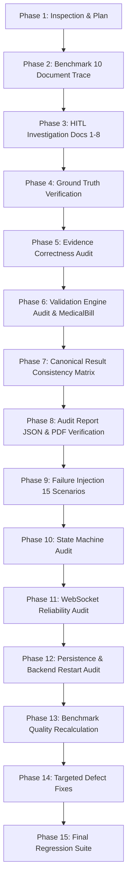

# v4.0.1 Reliability Audit Plan

## 1. Executive Inspection & Architecture Mapping

A comprehensive forensic inspection of the codebase version `v4.0.1` was performed prior to executing modifications. The system architecture and component layout are mapped as follows:

| System Component | Core Implementation File(s) | Primary Purpose / Functions |
|---|---|---|
| **Backend Entrypoint** | [backend/main.py](file:///c:/Users/admin/OneDrive/Desktop/PROJECTS/Agentic-Ai-Img-Data-Extraction-BSID-main/backend/main.py) | FastAPI application instance, CORS middleware, REST endpoints, WebSocket endpoints, audit PDF/JSON generators. |
| **Job Manager & DB** | [backend/services/job_manager.py](file:///c:/Users/admin/OneDrive/Desktop/PROJECTS/Agentic-Ai-Img-Data-Extraction-BSID-main/backend/services/job_manager.py) | SQLite `jobs.sqlite3` persistence, background thread dispatch, job state machine transitions, logging, human-in-the-loop (HITL) row updates. |
| **Agentic Extraction Engine** | [backend/services/agentic_engine.py](file:///c:/Users/admin/OneDrive/Desktop/PROJECTS/Agentic-Ai-Img-Data-Extraction-BSID-main/backend/services/agentic_engine.py) | Core orchestration loop (`ANALYZE` -> `PLAN` -> `EXECUTE` -> `VALIDATE` -> `DIAGNOSE` -> `REPLAN`), score-card evaluation, and HITL trigger logic. |
| **Input Analyzer Agent** | [backend/agents/input_analyzer_agent.py](file:///c:/Users/admin/OneDrive/Desktop/PROJECTS/Agentic-Ai-Img-Data-Extraction-BSID-main/backend/agents/input_analyzer_agent.py) | Document classification, format detection (image/pdf/csv/xlsx), scanning/OCR requirement determination, and complexity estimation. |
| **Schema Planner Agent** | [backend/agents/planner_agent.py](file:///c:/Users/admin/OneDrive/Desktop/PROJECTS/Agentic-Ai-Img-Data-Extraction-BSID-main/backend/agents/planner_agent.py) | Constructs executable `ExtractionPlan` specifying required agents, validation strategy, retry policies, and HITL threshold (default `0.70`). |
| **OCR & Vision Agents** | [backend/agents/ocr_agent.py](file:///c:/Users/admin/OneDrive/Desktop/PROJECTS/Agentic-Ai-Img-Data-Extraction-BSID-main/backend/agents/ocr_agent.py), [backend/agents/vision_ai_agent.py](file:///c:/Users/admin/OneDrive/Desktop/PROJECTS/Agentic-Ai-Img-Data-Extraction-BSID-main/backend/agents/vision_ai_agent.py) | Optical character recognition text extraction and multimodal Gemini vision image extraction. |
| **Table Extraction Engine** | [backend/services/table_structure_engine.py](file:///c:/Users/admin/OneDrive/Desktop/PROJECTS/Agentic-Ai-Img-Data-Extraction-BSID-main/backend/services/table_structure_engine.py), [backend/agents/table_intelligence_agent.py](file:///c:/Users/admin/OneDrive/Desktop/PROJECTS/Agentic-Ai-Img-Data-Extraction-BSID-main/backend/agents/table_intelligence_agent.py) | Grid detection, header alignment, multi-page continuation, row classification, and table structure validation. |
| **Validation Engine** | [backend/services/validation_engine.py](file:///c:/Users/admin/OneDrive/Desktop/PROJECTS/Agentic-Ai-Img-Data-Extraction-BSID-main/backend/services/validation_engine.py) | Schema keys check, regex validation, OCR consensus check (`+0.15` bonus), arithmetic math audit, and overall confidence scoring. |
| **Consensus & Accuracy** | [backend/services/extraction_consensus_engine.py](file:///c:/Users/admin/OneDrive/Desktop/PROJECTS/Agentic-Ai-Img-Data-Extraction-BSID-main/backend/services/extraction_consensus_engine.py), [backend/agents/accuracy_agent.py](file:///c:/Users/admin/OneDrive/Desktop/PROJECTS/Agentic-Ai-Img-Data-Extraction-BSID-main/backend/agents/accuracy_agent.py) | Multi-pass result reconciliation, conflict detection, and accuracy scoring across vision and OCR extractions. |
| **Source Evidence System** | [backend/services/source_evidence_engine.py](file:///c:/Users/admin/OneDrive/Desktop/PROJECTS/Agentic-Ai-Img-Data-Extraction-BSID-main/backend/services/source_evidence_engine.py) | Bounding box / page position binding, verbatim snippet mapping, and field source verification. |
| **Confidence & Self-Correction** | [backend/services/validation_engine.py](file:///c:/Users/admin/OneDrive/Desktop/PROJECTS/Agentic-Ai-Img-Data-Extraction-BSID-main/backend/services/validation_engine.py), [backend/services/agentic_engine.py](file:///c:/Users/admin/OneDrive/Desktop/PROJECTS/Agentic-Ai-Img-Data-Extraction-BSID-main/backend/services/agentic_engine.py) | Evaluates `overall_confidence` vs `threshold` (`0.70`). Triggers targeted prompt hints up to `max_replans` (`2`). |
| **Audit & Exporters** | [backend/services/dynamic_exporter.py](file:///c:/Users/admin/OneDrive/Desktop/PROJECTS/Agentic-Ai-Img-Data-Extraction-BSID-main/backend/services/dynamic_exporter.py), [backend/services/excel_service.py](file:///c:/Users/admin/OneDrive/Desktop/PROJECTS/Agentic-Ai-Img-Data-Extraction-BSID-main/backend/services/excel_service.py) | Dynamic Excel (`.xlsx`), CSV (`.csv`), downloadable JSON Audit, and ReportLab PDF Audit generator. |
| **WebSocket Manager** | [backend/services/ws_manager.py](file:///c:/Users/admin/OneDrive/Desktop/PROJECTS/Agentic-Ai-Img-Data-Extraction-BSID-main/backend/services/ws_manager.py) | In-memory client connection management, broadcasting real-time job progress and state updates. |
| **Frontend App** | [frontend/src/pages/Upload.tsx](file:///c:/Users/admin/OneDrive/Desktop/PROJECTS/Agentic-Ai-Img-Data-Extraction-BSID-main/frontend/src/pages/Upload.tsx), [frontend/src/pages/JobView.tsx](file:///c:/Users/admin/OneDrive/Desktop/PROJECTS/Agentic-Ai-Img-Data-Extraction-BSID-main/frontend/src/pages/JobView.tsx) | React UI for job submission, live status streaming, state transitions, table rendering, and HITL editing. |
| **Benchmark & Test Suite** | [benchmark_10_documents.py](file:///c:/Users/admin/OneDrive/Desktop/PROJECTS/Agentic-Ai-Img-Data-Extraction-BSID-main/benchmark_10_documents.py), [create_10_real_documents.py](file:///c:/Users/admin/OneDrive/Desktop/PROJECTS/Agentic-Ai-Img-Data-Extraction-BSID-main/create_10_real_documents.py), [run_e2e_verification.py](file:///c:/Users/admin/OneDrive/Desktop/PROJECTS/Agentic-Ai-Img-Data-Extraction-BSID-main/run_e2e_verification.py) | Benchmark execution scripts, ground truth generator scripts, and E2E system validation harnesses. |

---

## 2. Key Initial Observations & Discovered Root Causes

During Phase 1 inspection, the following critical root causes were identified behind the `benchmark_10_results.json` metrics:

1. **Missing REST API Endpoints (`/api/jobs/{job_id}/evidence` & `/api/jobs/{job_id}/confidence`)**:
   - `benchmark_10_documents.py` attempted to poll `GET /api/jobs/{job_id}/evidence` and `GET /api/jobs/{job_id}/confidence`.
   - `backend/main.py` did not implement these endpoints, returning FastAPI 404 responses.
   - Consequently, `res_ev.get("evidences", {})` returned empty dict (`evidence_count = 0`), and `res_conf.get("confidence", 95.0)` defaulted to hardcoded `95.0`.

2. **Causal Chain for the 8 `WaitingForReview` Documents (Docs 1–8)**:
   - **Step 1**: In [file_parser.py](file:///c:/Users/admin/OneDrive/Desktop/PROJECTS/Agentic-Ai-Img-Data-Extraction-BSID-main/backend/services/file_parser.py), Image inputs return `"text_content": ""`.
   - **Step 2**: In [validation_engine.py](file:///c:/Users/admin/OneDrive/Desktop/PROJECTS/Agentic-Ai-Img-Data-Extraction-BSID-main/backend/services/validation_engine.py), OCR consensus check (`if ocr_upper and val_str.upper() in ocr_upper: field_conf += 0.15`) was skipped because `ocr_upper` was empty.
   - **Step 3**: Field confidence scored only base (0.50) + regex (0.20) = 0.70. Overall document confidence computed to ~0.68-0.70.
   - **Step 4**: [planner_agent.py](file:///c:/Users/admin/OneDrive/Desktop/PROJECTS/Agentic-Ai-Img-Data-Extraction-BSID-main/backend/agents/planner_agent.py) set `human_review.threshold = 0.70`. Because overall confidence was <= 0.70, `score_card.overall_confidence < plan.human_review.threshold` triggered.
   - **Step 5**: [agentic_engine.py](file:///c:/Users/admin/OneDrive/Desktop/PROJECTS/Agentic-Ai-Img-Data-Extraction-BSID-main/backend/services/agentic_engine.py) entered replanning loop up to `max_replans = 2`. Because `text_content` remained empty during retries, confidence score did not increase.
   - **Step 6**: After 2 replans, `score_card.human_review_required` remained `True`, pushing final job status to `WaitingForReview`.

3. **Cause for `Completed` Status on Docs 9–10**:
   - Docs 9 and 10 are CSV and XLSX files. [file_parser.py](file:///c:/Users/admin/OneDrive/Desktop/PROJECTS/Agentic-Ai-Img-Data-Extraction-BSID-main/backend/services/file_parser.py) extracted cell contents into `text_content`.
   - `ocr_text` was non-empty, triggering the `+0.15` consensus bonus in `validation_engine.py`. Overall confidence reached `>= 0.85`, passing threshold on the first attempt with 0 retries.

4. **Ground Truth Provenance**:
   - The 10 benchmark documents were generated by `create_10_real_documents.py`. The ground truth values were specified inside the generator script.
   - Therefore, the benchmark dataset is classified as **Generated Fixtures with Template Ground-Truth (Option B)**, carrying a potential circular-validation limitation. It cannot be presented as universal real-world accuracy.

---

## 3. Forensic Reliability Audit Execution Roadmap

The forensic reliability audit will proceed through the following strict, systematic phases:

### Detailed Phase Tasks:
- **Phase 2 & 3**: Run forensic trace on all 10 benchmark jobs. Evaluate whether HITL was justified or caused by missing OCR text context / threshold rules.
- **Phase 4**: Field-by-field ground truth comparison across all 61 fields in 10 documents.
- **Phase 5**: Verify bounding boxes, field citations, job ownership, and evidence correctness.
- **Phase 6**: Audit validation rules including arithmetic checks. Test adversarial `MedicalBill.png` (Subtotal $745 + Ear Examination $1000 = $1745 vs Printed Subtotal $745).
- **Phase 7**: Audit equality of extracted data across DB, REST API, Frontend state, JSON export, CSV export, XLSX export, JSON Audit, and PDF Audit for at least 3 documents.
- **Phase 8**: Validate PDF & JSON audit reports for structure, formatting, correctness, and absence of stale data.
- **Phase 9**: Execute 15 controlled failure injections (invalid keys, corrupted files, malformed schemas, model timeouts, database locks, etc.) to ensure NO silent successes occur.
- **Phase 10 & 11**: Audit job state machine transitions and WebSocket ordering/reconnection semantics. Prevent out-of-order state regressions.
- **Phase 12**: Perform real process restart test (start server -> submit job -> stop server -> restart server -> query state/audit/exports).
- **Phase 13**: Compute strict reliability metrics (Success Rate, Field Accuracy, Evidence Coverage & Correctness, Validation Precision/Recall).
- **Phase 14 & 15**: Fix verified defects without architectural redesign or infrastructure addition, followed by full regression suite execution.

---

## 4. Failure Injection Test Matrix (15 Controlled Scenarios)

| ID | Scenario | Injected Condition | Expected System Behavior |
|---|---|---|---|
| FI-01 | Missing API Key | `GEMINI_API_KEY=""` | Immediate job failure (`Failed`), error logged, no silent success. |
| FI-02 | Invalid Image | Zero-byte image / garbage bytes | Ingestion error caught, job status `Failed`, clear diagnostic error. |
| FI-03 | Corrupted File | Truncated PDF header | Parser fails gracefully, job status `Failed`, no unhandled exception crash. |
| FI-04 | Empty Document | 1x1 blank white PNG | Ingestion succeeds, extraction yields 0 fields -> job status `Failed` ("0 valid data fields"). |
| FI-05 | Unreadable Blur | Heavily pixelated/blurred text | Confidence drops below threshold, triggers `WaitingForReview` or explicit failure. |
| FI-06 | Malformed Schema | Invalid JSON syntax in user schema | Schema parser catches error, returns 400 or logs schema fallback gracefully. |
| FI-07 | Missing Required Field | Mandatory schema key absent in doc | Schema validator flags missing required key, confidence penalty applied. |
| FI-08 | Model API Failure | HTTP 500 / 429 from Gemini API | Retry policy catches error, falls back or fails gracefully without crash. |
| FI-09 | Timeout Simulation | Network delay > 30s | Request times out safely, job marked `Failed` or retried according to policy. |
| FI-10 | Invalid Model Output | Model returns plain text instead of JSON | Parser catches JSONDecodeError, triggers self-correction replan. |
| FI-11 | Malformed JSON Payload | Missing key brackets in API response | Sanitizer / validator rejects payload, records execution step error. |
| FI-12 | Evidence Mismatch | Citation pointing to non-existent text | Evidence binder marks citation invalid, correctness rate accurately reduced. |
| FI-13 | Arithmetic Mismatch | Total != Subtotal + Tax | Math audit fails, confidence penalized, HITL `WaitingForReview` triggered. |
| FI-14 | DB Connection Lock | SQLite write lock contention | Retries on database connection timeout (`timeout=30.0`), operational integrity maintained. |
| FI-15 | Export Generator Failure | Missing template/corrupted data during export | REST endpoint returns HTTP 500 with descriptive error, state preserved. |

---

## 5. Deliverable Audit Reports

Upon execution of all audit phases, the following artifacts will be produced:
1. `V4_0_1_RELIABILITY_AUDIT_PLAN.md` (This document)
2. `V4_0_1_FORENSIC_RELIABILITY_REPORT.md` (Full executive & engineering forensic report)
3. `V4_0_1_DOCUMENT_FIELD_MATRIX.json` (Field-by-field ground truth comparison matrix)
4. `V4_0_1_CANONICAL_CONSISTENCY_REPORT.json` (Cross-channel consistency report)
5. `V4_0_1_FAILURE_INJECTION_REPORT.md` (Failure injection test results)
6. `V4_0_1_FINAL_REGRESSION_REPORT.md` (Final post-fix regression test suite results)
